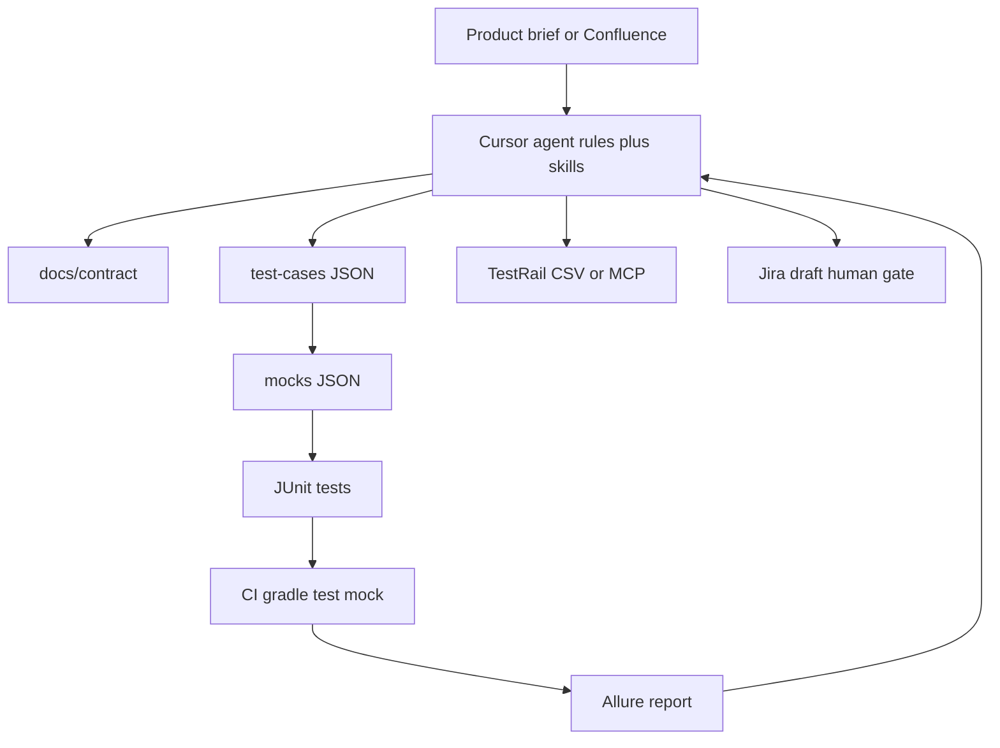

# AI strategy — test framework and automated regression

## Goal

Scale API-first regression (onboarding today; promos/start-screen tomorrow) using a **mock-first** Java framework, a **git catalog** as source of truth, and **AI agents** (MCP, CLI, Cursor rules, skills) for cross-tool work — without requiring a known production system upfront.

## Principles

- **API-first**, thin UI smoke (`data-testid` only).
- **Mock-first CI** — embedded `EmbeddedMockServer`; real stack is opt-in via `vod.test.target=real`.
- **Contract before code** — [docs/contract/onboarding-api.md](docs/contract/onboarding-api.md) defines endpoints until OpenAPI exists.
- **Catalog drives IDs** — `src/test/resources/test-cases/*.json` + `@TmsLink` + `./gradlew exportTestRail`.
- **English only** in tests, catalog, and prototype UI.
- **UI control names in titles** — visible labels `'Next'`, test ids `<btn-next>`.

## Current prototype map

```
com.vod.onboarding/
  common/harness/     BaseTest, TestEnvironment, BrowserFactory, PlaywrightTraceExtension
  common/domain/      ScenarioState (in-memory mock state)
  common/fixtures/    JsonSupport, MockJsonLoader, PreferencesRequestBuilder
  common/catalog/     TestCaseCatalog, TestRailExporter, CatalogValidator
  api/                ApiTestBase
  api/client/         VodApiClient
  api/mock/           EmbeddedMockServer, MockRouteRegistry, handlers, rules
  api/apiTests/       VodPreferencesApiTest
  ui/                 UiTestBase
  ui/pages/           OnboardingPage
  ui/uiTests/         OnboardingUiTest
```

## AI-assisted pipeline (repo + agent)



| Stage | AI agent | Human gate |
|-------|----------|------------|
| Contract | Draft/update `docs/contract/*` from brief | Approve contract |
| Catalog | Generate `test-cases/*.json` | ~20% triage |
| Mocks + handlers | Golden JSON + `MockRouteHandler` | Spot-check errors |
| Tests | Java tests + page objects | `./gradlew test` |
| Self-check | Compare tests vs catalog | PR review |
| Failure | Skill `ci-failure-to-jira` | Approve Jira create |

## Agent orchestration (primary integration strategy)

**Agents** connect Confluence, Jira, TestRail, GitHub — not custom Java REST clients by default.

| Layer | Responsibility |
|-------|----------------|
| Repo / Gradle | Tests, mocks, `validateCatalog`, `exportTestRail` |
| CI | `gradle test`, Allure artifacts (no LLM) |
| Cursor agent | MCP read/write, edit repo, run CLI |
| Human | Approve contract, catalog, Jira |

See [docs/ai-workflow.md](docs/ai-workflow.md) and [docs/integrations/mcp-setup.md](docs/integrations/mcp-setup.md).

### Cursor rules (`.cursor/rules/`)

- English-only, catalog source of truth, MCP-first integrations, no invented APIs, page objects without assertions.

### Agent skills (`.cursor/skills/`)

- `confluence-to-catalog`, `jira-story-to-catalog`, `catalog-to-tests`, `ci-failure-to-jira`, `catalog-to-testrail`.

### Prompt templates (`prompts/`)

Referenced by skills; historical log in [PROMPTS.md](PROMPTS.md).

## Tool integrations

| System | Direction | How |
|--------|-----------|-----|
| Confluence | Read | Agent MCP → `docs/briefs/*.md` |
| Jira | Read + write (gated) | MCP fetch; draft bug only after human OK |
| TestRail | Write | `./gradlew exportTestRail` + MCP or manual import |
| Allure | Write | CI + local; trace on UI failure |
| GitHub | Write | Actions, `gh` PR comments |

Optional catalog fields: `jira_key`, `confluence_url`, `testrail_case_id`.

## Stability guardrails

| Risk | Mitigation |
|------|------------|
| Flaky selectors | `data-testid` only |
| Drift vs backend | Contract doc; optional OpenAPI diff later |
| Stateful mocks | `ScenarioState.reset()` in `BaseTest` |
| AI invents endpoints | Contract required before new routes |
| Promo overload | `@Tag("promo-*")`; CI subsets `-Pgroups=api` |

## Scaling to new features (e.g. promos)

1. Add `docs/contract/{feature}.md`.
2. Add `test-cases/{feature}.json`.
3. Add `mocks/{campaign}/` + `MockRouteHandler` implementation.
4. Package `com.vod.{feature}.{campaign}` mirroring onboarding.
5. Tag `@Tag("{feature}")` for selective CI.

| Campaign (example) | API focus | UI smoke |
|--------------------|-----------|----------|
| New movie promo | POST impression/click | Modal + CTA |
| Series premiere | GET eligibility | Dismiss |
| Partner bundle | POST opt-in | Logo link |
| Subscription discount | POST apply-coupon | CTA enabled |

## Real system unknown — policy

- Default: **mock only**.
- `vod.test.target=real` + `VOD_BASE_URL` when staging exists.
- `@Tag("real-smoke")` tests use `RealSmokeGuard` (skip if URL missing).
- Do not treat Confluence/Jira text as runtime API without contract approval.

### When real system becomes known

1. Import OpenAPI → diff `docs/contract`.
2. Update mocks/handlers or disable tests with reason.
3. Enable nightly `real-smoke` with secrets in CI.
4. Validate auth via `VOD_BEARER_TOKEN` / `vod.api.key` env (never in git).

## CI failure → Jira (design)

1. Artifacts: Allure, Playwright trace, Surefire XML, API last-response attachment.
2. Agent skill drafts `build/jira-draft.md`.
3. Human approves; agent or human posts via Jira MCP.
4. No auto P1; redact tokens.

## Metrics

- Catalog coverage: % with `automated_in`
- PR label `ai-generated` (optional)
- Review defects per feature
- CI duration: api vs ui jobs

## Java integration clients

Add `common/integrations/*` REST clients **only** if MCP/CLI cannot be used in your org. Default path is agent + MCP.
