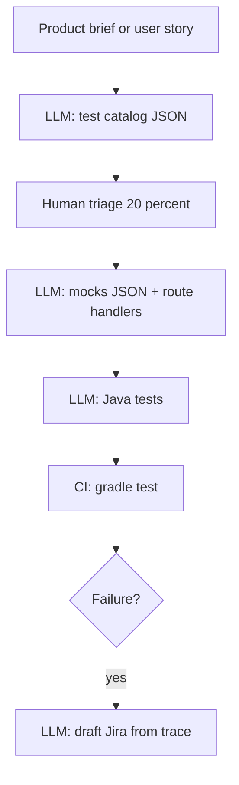

# AI strategy — scaling generated regression

## Goal

Repeat the VOD onboarding approach for broader regression: start-screen promos (movie/series offers, partner integrations, subscription discounts), still **API-first** with thin UI smoke.

## Pipeline

1. **Brief → catalog** — Same JSON schema as `src/test/resources/test-cases/vod-preferences.json`; tag `creative_type`, `layer`, `automation_candidate`.
2. **Triage** — Remove duplicates; fix HTTP codes and IDs; ~20% human edit is enough for quality gate.
3. **Mocks** — Golden files under `src/test/resources/mocks/{campaign}/`; one `installXxxMocks(context)` per feature family.
4. **Tests** — JUnit classes per API surface + one UI class per modal variant (CTA, dismiss, show-once).
5. **CI** — Single `./gradlew test`; no WireMock container.

## Stability guardrails

| Risk | Mitigation |
|------|------------|
| Flaky selectors | `data-testid` only for UI; no x/y/color asserts |
| Drift vs backend | OpenAPI snippet in prompt; contract test job optional |
| Stateful mocks | Reset state `@BeforeEach`; one context per test |
| AI wrong route/host assumptions | Embedded localhost mock server with explicit endpoint handlers |
| Promo overload | Tag tests `@Tag("promo-subscription")` etc.; run subsets in PR |

## Reuse from this prototype

- `PlaywrightTestBase` + embedded localhost server pattern → `PromoMockServer` with campaign-specific endpoint handlers
- `PreferencesState` → generic `ScenarioState` keyed by user/profile + campaign
- Playwright route-served static page or real staging URL behind env `BASE_URL`

## CI failure → Jira (design)

1. **Artifacts:** Playwright trace (on retry), Surefire XML, last request/response from test logs.
2. **LLM prompt:** “Given trace + test name + expected invariant, draft Jira: title, steps, expected/actual, component, severity suggestion.”
3. **Automation:** GitHub Action posts to Jira REST only after `needs-review` label or slack approval.
4. **Guardrails:** Redact tokens; never auto-create P1; link build URL and commit SHA.

## Metrics (80% AI claim)

Track per feature:

- Lines with `// AI-GENERATED` vs hand-edited in PR
- Time: catalog + mocks + tests (AI-assisted) vs historical manual estimate
- Defects found in review (prompt quality KPI)

## Internal ads example

| Campaign | API focus | UI smoke |
|----------|-----------|----------|
| New movie promo | POST impression/click tracking | Modal visible, CTA opens title |
| Series premiere | GET eligibility | Dismiss hides until next session |
| Partner bundle | POST opt-in | Partner logo link (role/name only) |
| Subscription discount | POST apply-coupon mock | CTA enabled when coupon valid |

Same repo layout: new package `com.vod.promo.{campaign}`, shared `support/PromoMockServer.java` delegating to campaign-specific JSON.
